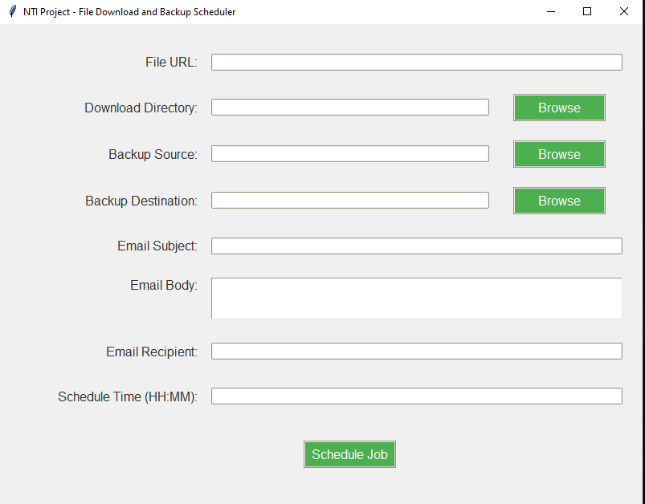

## File Download and Backup Scheduler

### Overview
The File Download and Backup Scheduler is a Python application designed to automate the process of downloading files, backing up important data, and sending email notifications. This project utilizes various Python libraries to provide a user-friendly interface for scheduling tasks.

### Features
- **File Downloading**: Users can specify a URL to download files automatically.
- **Data Backup**: The application can back up specified directories to a designated location, creating zip archives for easy storage.
- **Email Notifications**: Users can configure email notifications to receive updates upon successful completion of download and backup tasks.
- **Task Scheduling**: Users can schedule these tasks to run daily at a specified time.

### Technologies Used
- **Python**: The primary programming language used for developing the application.
- **Tkinter**: For building the graphical user interface (GUI).
- **Schedule**: To handle scheduling of tasks.
- **Requests**: For downloading files from the web.
- **Shutil**: For file operations, including creating zip archives.
- **smtplib**: For sending email notifications.

### Installation
To set up and run the project, follow these steps:

## How to set up and run the project

1. Clone the repository:
   ```bash
   git clone https://github.com/yousefelhattab/Python-Scripting.git

2. Navigate to the project directory:

 bash

    cd Python-Scripting

3.Install the required dependencies:

bash

    pip install -r requirements.txt

4.Run the desired script:

bash

    python main.py

### Usage
1. Launch the application.
2. Enter the required details for file downloading, backup source, destination, email subject, and body.
3. Schedule the job to run at your desired time.
### GUI Preview
 
